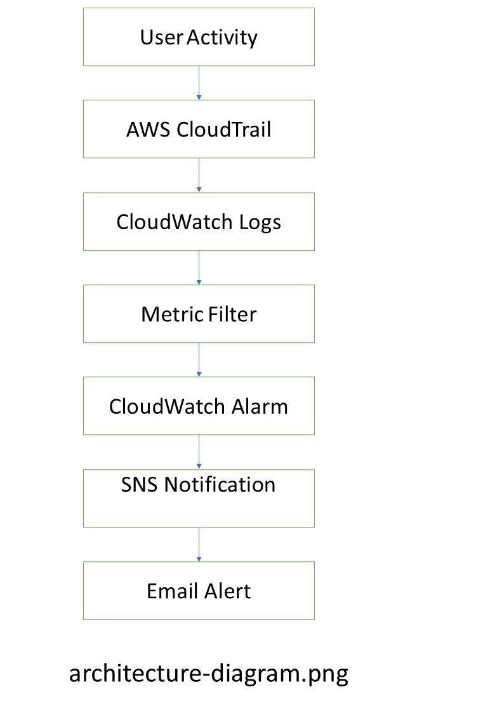

# 🚀 Project Title (Example: AWS Highly Available Web Architecture)

## 📌 Overview
Designed and deployed a highly available, scalable, and secure cloud architecture on AWS using load balancing, auto scaling, monitoring, and logging.

---

## 🔥 Live Proof

✔ Infrastructure deployed on AWS  
✔ Auto Scaling tested with simulated traffic  
✔ Load Balancer distributing requests  
✔ Monitoring and alerting configured  

---

## 🧱 Architecture

---

## ⚙️ AWS Services Used

- Amazon EC2
- Application Load Balancer
- Auto Scaling Group
- Amazon RDS (MySQL)
- Amazon S3
- CloudWatch
- CloudTrail
- AWS Athena

---

## 📊 Results / Impact

- Achieved high availability with Auto Scaling  
- Load distributed efficiently using ALB  
- Real-time monitoring enabled with CloudWatch  
- Security logging implemented using CloudTrail  
- Log analysis performed using Athena  

---

## 🛠 Setup / Implementation Steps

1. Launch EC2 instances  
2. Configure Application Load Balancer  
3. Setup Auto Scaling Group  
4. Configure RDS database  
5. Enable CloudWatch monitoring  
6. Enable CloudTrail logging  
7. Analyze logs using Athena  

---

## 📸 Screenshots

### Load Balancer

### Auto Scaling Group

### EC2 Instances

### CloudWatch Monitoring

---

## 💡 Key Learnings

- Hands-on experience with AWS architecture  
- Understanding of high availability design  
- Monitoring and logging implementation  
- Security and auditing using CloudTrail  

---

## 🔗 GitHub Repository

https://github.com/rajankumarup56/aws-highly-available-web-architecture

---

## 👨‍💻 Author

Ranjan Kumar Upadhyay  
DevOps & Cloud Enthusiast 🚀
